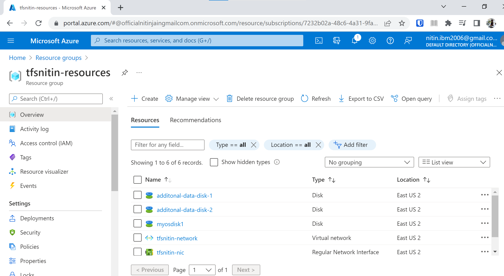

# Terraform Deploy First VM

- go to https://registry.terraform.io/providers/hashicorp/azurerm/latest/docs/resources/virtual_machine
and copy sample code for virtual machine from azure.

- adding sample code here https://github.com/njain51/terra-sample-azure/1.0_First_VM/main.tf

```text
D:\mylearning\terra-sample-azure\1.0_First_VM>terraform init

Initializing the backend...

Initializing provider plugins...
- Reusing previous version of hashicorp/azurerm from the dependency lock file
- Using previously-installed hashicorp/azurerm v3.4.0

Terraform has been successfully initialized!

You may now begin working with Terraform. Try running "terraform plan" to see
any changes that are required for your infrastructure. All Terraform commands
should now work.

If you ever set or change modules or backend configuration for Terraform,
rerun this command to reinitialize your working directory. If you forget, other
commands will detect it and remind you to do so if necessary.

```

### getting tenantid, clientid and secret

[reference](https://geeksarray.com/blog/get-azure-subscription-tenant-client-id-client-secret)

#### subscription_id:

- Azure subscription ID is a GUID that identifies your subscription and underlying services.

- go to portal.azure.com
- subscriptions
- get subscription id


#### tenant ID:
- Tenant Id is the unique identifier of the Azure Active Directory instance.
  - One subscription can have multiple tenants.


- go to portal.azure.com
- search for azure active directory
- https://portal.azure.com/#blade/Microsoft_AAD_IAM/ActiveDirectoryMenuBlade/Overview -> Properties
- get Tenant Id here


### client id and secret

- Azure Client Id is Active Directory Application Id. 
  - Client Id is the unique identifier of an application created in Active Directory. 
  - You can have many applications in an Active Directory. 
  - Each application will have a different access level.


- **How to get Client id**
  - go to azure portal
  - app registrations
  - create new app: terraform-azure-nitin
  - can find client id automatically generated 
  - can add secret here and copy secret when first time its generated


**Note**: 
- Terraform has created a lock file .terraform.lock.hcl to record the provider selections it made above. 
- Include this file in your version control repository
so that Terraform can guarantee to make the same selections by default when you run "terraform init" in the future.

 
### Creating sample VM via plan

- check code for first VM [here](https://github.com/njain51/terra-sample-azure/tree/main/1.0_First_VM)  
- run following commands:

```text
terraform init
terraform plan
terraform apply
```
 
- following resources were created: 

 
- note the additional disk that were created as part of plan 


