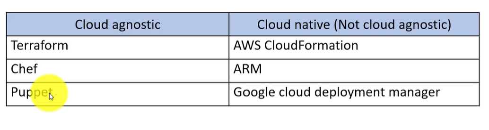

# Comparison of IaC Tools

- cloud providers have their own deployment automation technologies
- code is designed to provision and manage infra only on specific cloud 
- Cloud Agnostic Tools like Terraform works with on-premises servers and multiple cloud provider IaC offerings. 

- Chef, Puppet,Ansible, SaltStack are configuration management tools
  - it helps manage configuration of systems and apps running on system 
  - it can be tweaked to provide to provide infra provision capabilities but not good idea. 

- CloudFormation, Terraform, OpenStack Heat are provisioning tools 
  - provisioning tools helps to provision infrastructure 
  - it helps manage networks, compute instances, load balances etc. 
  - 

- Cloud Provider Tool such as Terraform focus on single cloud or simple hybrid cloud deployment
- they use terraform as an extension on their own IaC tools

### Terraform advantages over others 

- provision infra using hasicorp configuration language or JSON
- written in Go
- Open Source 
- codifies api to declarative config files
- files are treated as code - can be versioned 

- IaC tool 
- Resource graph - terraform creates resource graph for multiple resources 
- Change Automation - Complex automation change can be reviewed 

### Procedural Vs Declarative:

- Chef,Ansible encourage procedural style where we write code that specifies how to achieve desired state
  - Procedural Code doesn't fully capture state of infrastructure 
- Terraform , Cloud Formation, SaltStack promotes more declarative style. You specify your desired state and IaC tool figures out how to achieve it. 

### Master and Agents:

- Chef, Puppet, Saltstack require Master server to store infra state 
  - Commands are issues on master server and it then runs it on agent machines 
- terraform is primarily master less
- terraform communicate with cloud provider using cloud provider API 
- with terraform you don't need to install any agent Software, example Salt Minion, Puppet agent, Chef Client runs in background on agent machines. 

### State files

- Terraform follows stateful management approach 
- state of infra contains through info on provisioned infra and its various configurtions 
- when we create infra, terraform will store all configs in state file. 
- 

- 